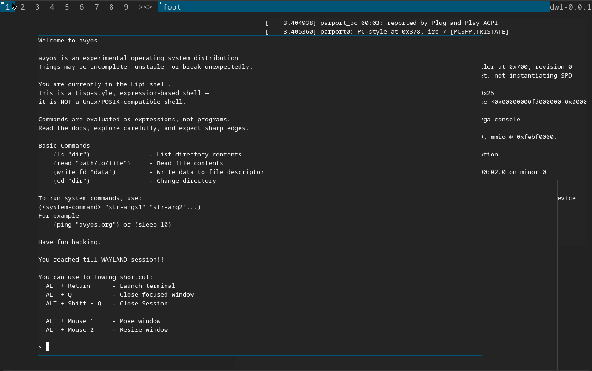

# avyos

**avyos** is a minimal, experimental operating system project.

The goal of avyos is to explore how far a mostly **pure Go** system can go, while keeping the system simple, readable, and hackable.

> ⚠️ Experimental project. Things *will* break.

---

<p align="center">
  
</p>

## Goals

- Build a **full operating system in Go**
- Keep components small, explicit, and easy to understand
- Prefer clarity and control over POSIX compatibility
- Gradually eliminate legacy dependencies

---

## Roadmap

1. **Bootstrap phase**  
   Build a usable operating system by **reusing existing components**:
   - Linux kernel
   - GCC toolchain
   - Mesa
   - Wayland / wlroots
   - Traditional C libraries where unavoidable

2. **Replacement phase**  
   Incrementally replace reused components with **simple, pure Go**
   implementations:
   - init system
   - service manager
   - IPC bus
   - shell
   - device management
   - userspace libraries
   - graphics and input stack

The system is expected to stay **bootable and usable at every step**.

---

## Current Status

avyos has crossed the “toy OS” stage and is now a **working experimental system**.

### Core system

- ✅ Fully bootable disk image generated by the avyos build system
- ✅ QEMU-based development workflow
- ✅ Modified, non-standard Unix-like root filesystem layout
- ✅ Custom **init** and **service model**

### Shell

- ✅ **Lipi shell** implemented and fully usable  
  - Lisp-inspired
  - Not POSIX, not `/bin/sh` compatible
  - Designed specifically for avyos

### Graphics & UI

- ✅ Wayland stack working
- ✅ **Mesa** providing hardware-accelerated graphics
- ✅ **wlroots + dwl compositor** running successfully
- ✅ Accelerated rendering confirmed

### Toolchain & externals

- ✅ **36 external components** integrated
- ✅ Full **GCC compiler toolchain**
- ✅ Mesa, Wayland, wlroots, libinput, and supporting libraries

### IPC & Services

- ✅ Working IPC service bus named **`connect`**
- ✅ Used by **init** and system **services**
- ✅ Designed for structured, binary IPC (no JSON or strings in hot paths)
- ✅ **apigen** tool implemented
- ✅ Generates **client-side and service-side IPC code**
- ✅ Uses API specifications located at:
  ```
  /api/<service>/api.json
  ```

---

## Build & Run

Build everything (kernel, userland, rootfs, disk image):

```sh
make
```

Run on amd64 using QEMU:

```sh
make -C device/amd64 run
```

---

## Code Layout

| Directory     | Purpose                                       |
| ------------- | --------------------------------------------- |
| `_external/`  | External source code (third-party components) |
| `api/`        | Api specification and generated go code       |
| `build/`      | Toolchains and build tools                    |
| `cmd/`        | System commands                               |
| `config/`     | Configuration files                           |
| `data/`       | Fonts, images, icons, and static assets       |
| `device/`     | Device / architecture-specific targets        |
| `init/`       | Init systems and kernels                      |
| `init/kernel` | Linux kernel (current)                        |
| `init/sutra`  | Experimental pure-Go “kernel”                 |
| `lib/`        | Required C libraries                          |
| `pkg/`        | Go packages                                   |
| `scripts/`    | Helper and build scripts                      |
| `services/`   | System services                               |
| `api/`        | IPC API specifications (`api.json`)           |
| `tools/`      | Build tools (including `apigen`)              |

---

## Notes

- ❌ Not POSIX-compliant (by design)
- ❌ Not a traditional Unix system
- ⚠️ APIs, layouts, and interfaces are unstable
- 🔁 Frequent refactors are expected
- 🎯 Primary focus: **clarity, control, and Go-first design**
