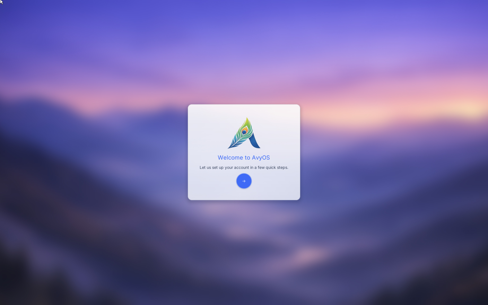
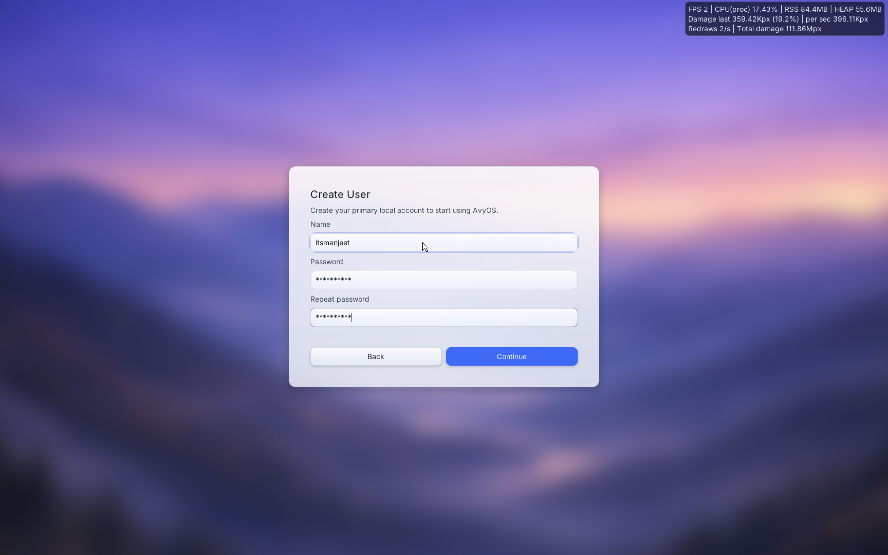
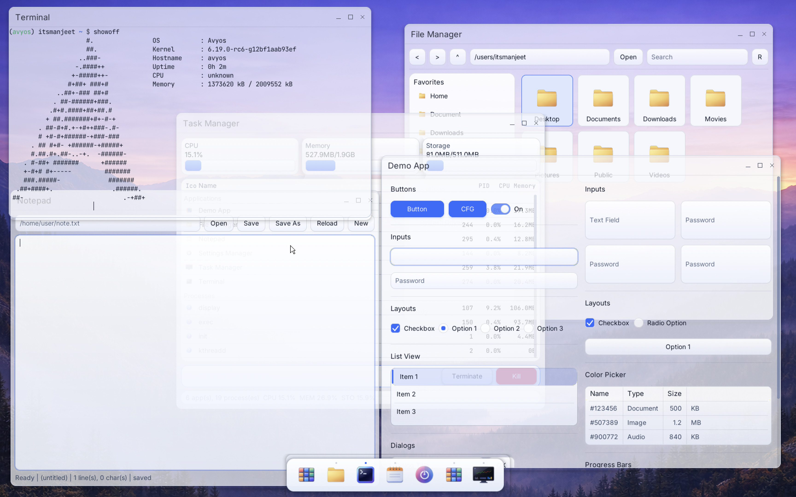
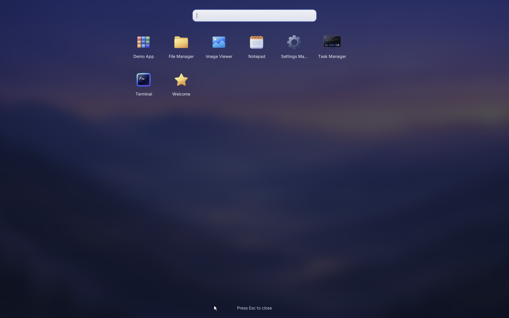
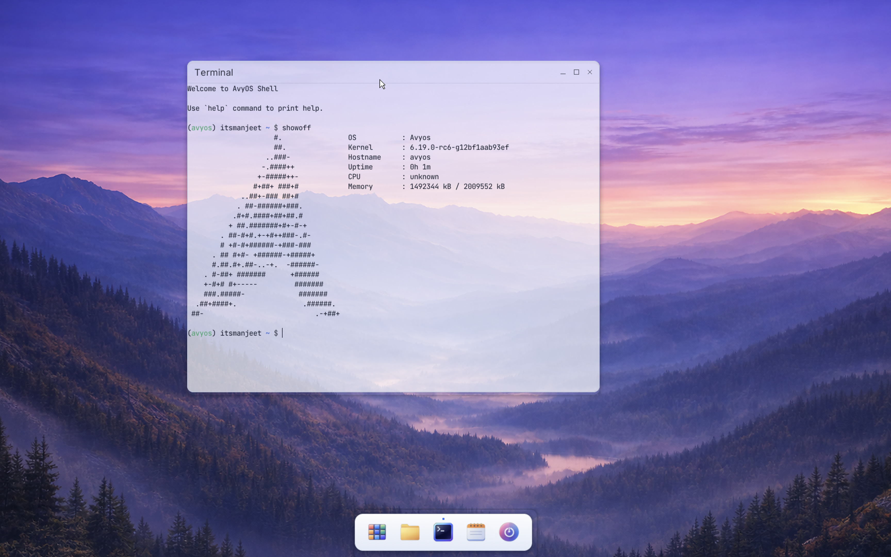

# Welcome Tour

## 1) Boot to the Welcome Screen

On first boot you’ll see the **Welcome Screen**:

<p align="center">
  
</p>

### If your mouse/keyboard doesn’t work
Input problems are usually caused by a host/QEMU configuration issue.

Try these steps:

1. **Reboot and try again** (sometimes QEMU input devices fail to initialize on the first run).
2. If you started avyos using the one-command runner (`runimage`), **try running QEMU manually** instead (see the QEMU commands in `README.md` → “Try avyos”).
3. If it still doesn’t work, please open an issue:
   - https://github.com/itsManjeet/avyos/issues

When filing an issue, include:
- your host OS (Linux/macOS/Windows), CPU architecture
- how you launched avyos (`runimage` or manual QEMU command)
- QEMU version
- whether VNC is enabled
- any logs or console output you can capture

---

## 2) Create a User Account

Next, avyos prompts you to create one or more user accounts:

<p align="center">
  
</p>

This account is what you’ll use to log into the desktop.

### Fallback superuser account (for debugging)
If you get stuck or need to debug the system, there is a fallback account:

- **username:** `admin`  
- **password:** `admin`  
- **note:** this is the **superuser** account (**UID 0**) intended for troubleshooting and development.

---

## 3) Log In

After account creation, you’ll reach the **Login Screen**.
Select your user and enter the password.

If login fails:
- verify you’re selecting the correct user
- try the fallback `admin/admin` credentials to confirm the system is healthy

---

## 4) Desktop Interface

After login you’ll see the desktop:

<p align="center">
  
</p>

### What you’re looking at
- **Wallpaper/background**
- **Dock** at the bottom:
  - **App Launcher**
  - **Pinned apps**
  - **Power button** (Lock / Reboot / Power off)

---

## 5) Basic UI actions

### Desktop actions
- **Right click on the desktop** to open the context menu (common actions and shortcuts).

### App launcher

<p align="center">
  
</p>

- Click the **App Launcher** icon in the dock to list installed apps.
- Select an app to launch it.

### Dock app icon actions
- **Left click** a dock icon to focus/launch.
- **Right click** an app icon in the dock for common actions:
  - **Close**
  - **Pin / Unpin**
  - **Open new window** (when supported)

### Power menu
Use the **Power button** on the dock to:
- Lock the session
- Reboot
- Power off

---

## 6) Terminal quick start

<p align="center">
  
</p>

Open the terminal and run:

```sh
help
```

This lists the available built-in commands and utilities shipped in the OS core.

### Managing the Linux distro layer
Use the `distro` command to manage the optional Linux distro compatibility layer.

- Command reference: `sbin/distro.md`

---

## 7) Show off avyos 🙂

There’s a `showoff` command intended to help you share your setup on community forums:

```sh
showoff
```

Use it to produce a neat summary/screenshot-friendly output when posting about avyos.

---

## 8) Feedback and issues

If something looks wrong, crashes, or doesn’t behave as expected, please open an issue:

- https://github.com/itsManjeet/avyos/issues
